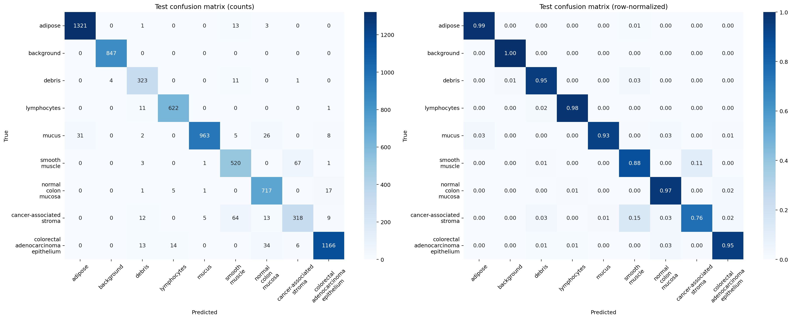
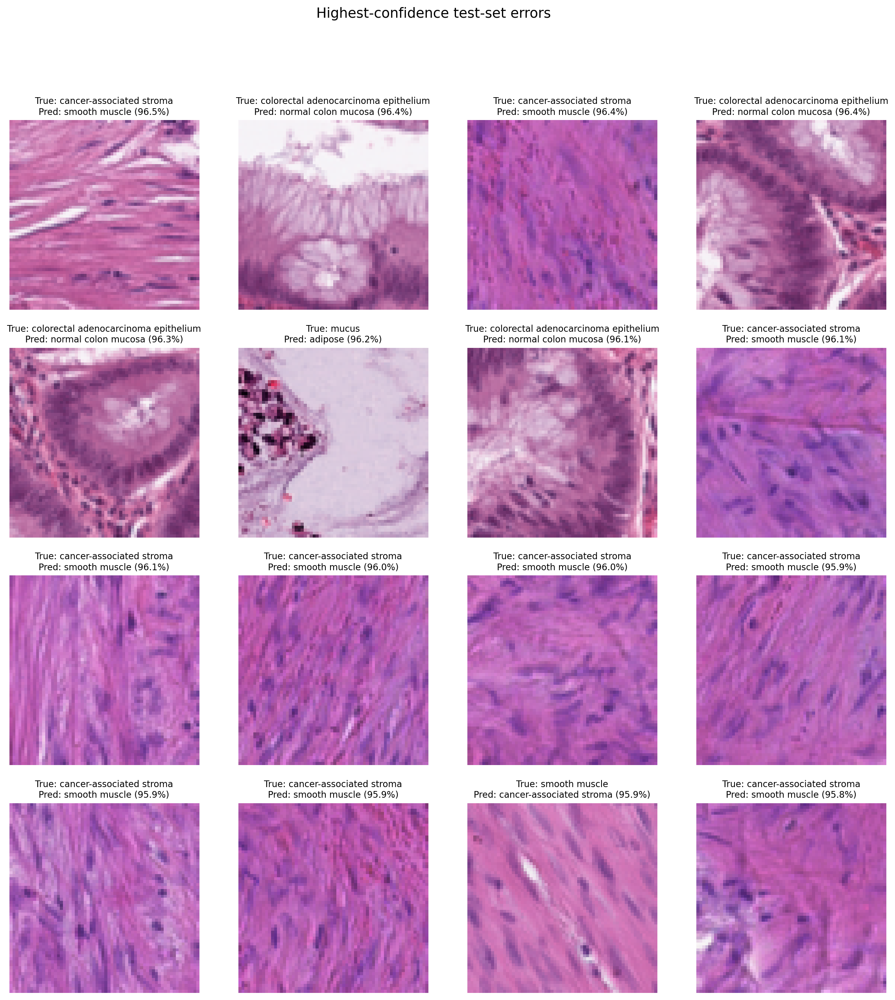
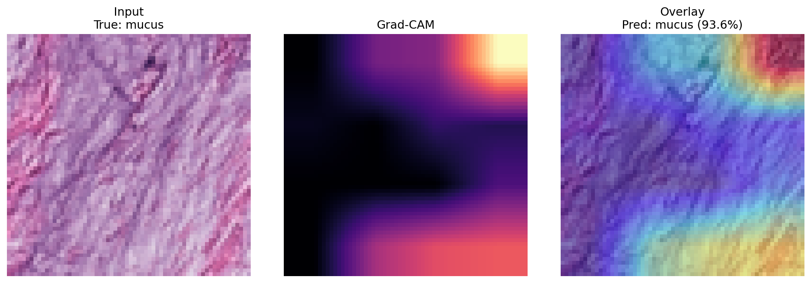

# PathMNIST histopathology classification

[](https://github.com/ingrid-burrowes/pathmnist-histopathology/actions/workflows/ci.yml)
[](https://colab.research.google.com/github/ingrid-burrowes/pathmnist-histopathology/blob/main/notebooks/run_in_colab.ipynb)

A reproducible PyTorch project for nine-class colorectal tissue classification on
[PathMNIST](https://medmnist.com/). It compares a custom convolutional neural
network with an ImageNet-pretrained ResNet-18, selects models using validation data
only, and produces clinically cautious performance and interpretability artifacts.

> **Research/education only.** This project is not a medical device and must not be
> used for diagnosis, treatment, or patient-level decisions.

## Why this project

Histopathology models can appear strong when the train, validation, and test roles
are blurred or when only overall accuracy is reported. This repository makes those
choices explicit:

- the official PathMNIST train/validation/test splits are preserved;
- checkpoints are selected by validation macro-F1 with early stopping;
- the test set is accessed only by the separate evaluation command;
- accuracy, macro-F1, per-class precision/recall/F1, and confusion matrices are saved;
- high-confidence errors are shown rather than hiding failure cases;
- Grad-CAM is provided as a qualitative inspection tool, not an explanation of
  clinical reasoning;
- experiment settings are stored in version-controlled YAML files.

## Dataset

PathMNIST contains **107,180 H&E-stained colorectal histology patches** from nine
tissue classes. The official split contains 89,996 training, 10,004 validation, and
7,180 test images. The test set comes from a different clinical centre, making it a
more meaningful distribution-shift check than a random held-out sample.

This project defaults to the 64×64 MedMNIST+ release. The dataset is downloaded by
the official `medmnist` package and is excluded from Git. The label order is:

1. adipose
2. background
3. debris
4. lymphocytes
5. mucus
6. smooth muscle
7. normal colon mucosa
8. cancer-associated stroma
9. colorectal adenocarcinoma epithelium

## Methods

### Models

**Custom CNN.** Three convolutional blocks, each containing two 3×3 convolutions,
batch normalization, ReLU activations, and 2×2 max pooling, followed by adaptive
average pooling, dropout, and a nine-class linear head.

**ResNet-18.** ImageNet-pretrained ResNet-18 with a new dropout and nine-class
classification head. All layers are fine-tuned. Inputs retain the official 64×64
resolution; no artificial upscaling to 224×224 is performed.

### Training

Training uses AdamW, cross-entropy with light label smoothing, ImageNet
normalization, and conservative augmentations: horizontal/vertical flips, small
rotations, and mild colour jitter. The orientation of these tissue patches is not
intrinsically meaningful, while restrained colour changes simulate limited staining
variation without claiming full stain normalization.

Early stopping monitors validation macro-F1 with `min_delta=0.001`. A checkpoint is
replaced only when the improvement exceeds that threshold; this avoids treating
negligible fluctuations as meaningful gains. `ReduceLROnPlateau` lowers the learning
rate when the same validation measure stops improving. Randomness is seeded across
Python, NumPy, PyTorch, and data-loader workers.

## Quick start

Python 3.10 or newer is required. A CUDA-enabled environment such as Google Colab is
recommended for full training.

For a guided GPU run, use the **Open in Colab** badge above and run the notebook cells
in order. The CNN and ResNet-18 experiments are deliberately separate so their
outputs can be checked before continuing.

```bash
git clone https://github.com/ingrid-burrowes/pathmnist-histopathology.git
cd pathmnist-histopathology
python -m pip install -e .
```

Train the custom CNN:

```bash
pathmnist-train --config configs/cnn.yaml
```

Train ResNet-18:

```bash
pathmnist-train --config configs/resnet18.yaml
```

The training command downloads PathMNIST automatically, creates `history.csv`, and
saves the checkpoint selected by validation macro-F1 and the configured improvement
threshold. It does **not** load the test split.

Evaluate a selected checkpoint once:

```bash
pathmnist-evaluate --checkpoint outputs/resnet18/best_checkpoint.pt
```

This creates:

```text
outputs/resnet18/test/
├── confusion_matrix.png
├── metrics.json
├── per_class_metrics.csv
├── predictions.csv
└── representative_errors.png
```

Create Grad-CAM for a test image:

```bash
pathmnist-gradcam \
  --checkpoint outputs/resnet18/best_checkpoint.pt \
  --split test \
  --index 42
```

Every important training choice can be changed in `configs/cnn.yaml` or
`configs/resnet18.yaml`. Use a new `output_dir` for every experiment so outputs do not
overwrite one another.

## Results

The final configurations were chosen using the official validation split. Each
selected checkpoint was then evaluated once on the official test split. These are
the outputs from that run, not values copied from the MedMNIST benchmark.

| Model | Selected epoch | Validation macro-F1 | Test accuracy | Test macro-F1 |
|---|---:|---:|---:|---:|
| Custom CNN | 20 | 0.9935 | 0.9148 | 0.8934 |
| ResNet-18 | 8 | 0.9904 | **0.9467** | **0.9300** |

ResNet-18 improved test accuracy by **3.19 percentage points** and test macro-F1 by
**3.67 points** over the custom CNN. Although the CNN had a slightly higher selected
validation macro-F1, its larger validation-to-test gap shows why the external-centre
test split is important. The gap is consistent with distribution shift; it should
not be interpreted as proof of one specific causal mechanism.

### Per-class performance and errors

ResNet-18 achieved its strongest F1 scores on background (0.9976), adipose (0.9822),
lymphocytes (0.9757), mucus (0.9606), and colorectal adenocarcinoma epithelium
(0.9577). Cancer-associated stroma remained the hardest class (F1 0.7823), followed
by smooth muscle (F1 0.8631). Compared with the CNN, ResNet-18 increased stroma
recall from 0.5131 to 0.7553.

The confusion matrix shows that the main remaining error pattern is
cancer-associated stroma versus smooth muscle. A second clinically relevant pattern
is colorectal adenocarcinoma epithelium versus normal colon mucosa. The
highest-confidence errors below make these failures inspectable rather than hiding
them behind aggregate metrics.





### Grad-CAM

The Grad-CAM example uses ResNet-18's final block in `layer3`, which has a 4×4
feature map for 64×64 inputs. The network's final stage is only 2×2 at this image
size and produced localization too coarse to inspect. Even the 4×4 map remains a
low-resolution qualitative aid: the highlighted region does not establish a causal
or clinically valid explanation.



Compact run artifacts—including complete metrics, per-class tables, training
histories, and checkpoint-selection summaries—are available in [`results/`](results/README.md).
Raw predictions, datasets, and model checkpoints are excluded from version control.

## Tests

The tests use synthetic tensors and do not download PathMNIST.

```bash
python -m pip install -e ".[dev]"
ruff check .
pytest
```

GitHub Actions runs the same lint and test checks on every push and pull request.

## Limitations and responsible interpretation

- PathMNIST contains small pre-extracted patches, not whole-slide images. This
  project does not address tissue detection, slide tiling, aggregation, or
  patient-level prediction.
- Patch accuracy cannot establish clinical safety, clinical utility, or
  generalization to other scanners, laboratories, staining protocols, populations,
  specimen types, or disease settings.
- Class labels are inherited from the source dataset and are not independently
  reviewed in this project.
- The official test set is from a different centre, but a single external centre is
  insufficient for broad external validation.
- Augmentation is not a substitute for explicit stain normalization or multi-centre
  training.
- Grad-CAM is a coarse localization method. A plausible heatmap does not prove that
  a model used biologically valid features or provide a causal explanation.
- This is a patch-classification study for technical demonstration and education,
  not a clinical claim.

## Reproducibility notes

Exact reproducibility can still vary across hardware and PyTorch/CUDA versions even
with deterministic settings. Each checkpoint records its complete resolved config,
class order, selected epoch, and validation metrics. Dataset files, model weights,
raw predictions, and uncurated generated outputs are excluded from version control;
the compact final-run evidence in `results/` is tracked for auditability.

## Attribution

PathMNIST is distributed as part of MedMNIST under CC BY 4.0 and derives from the NCT-CRC-HE-100K and CRC-VAL-HE-7K colorectal histology datasets. Accordingly, this project cites both sources:

- Yang J, Shi R, Wei D, et al. [MedMNIST v2: A large-scale lightweight benchmark for
  2D and 3D biomedical image classification](https://doi.org/10.1038/s41597-022-01721-8).
  *Scientific Data*. 2023;10:41.
- Kather JN, Halama N, Marx A. [100,000 histological images of human colorectal
  cancer and healthy tissue](https://doi.org/10.5281/zenodo.1214456). Zenodo. 2018.

The source code in this repository is released under the MIT License. The dataset
retains its own license and is not redistributed here.
